# دليل استخدام نظام إدارة التوزيع

**نظام تخطيط موارد لشركات بيع وتوزيع المواد الغذائية بالجملة**

هذا الدليل يشرح النظام من أوله إلى آخره: كيف تُعِدّه أول مرة، وكيف تُدير به يوم عمل كامل من استلام البضاعة حتى إقفال الصندوق وطباعة التقارير. كل فصل يبدأ بشرح مختصر لوظيفة الشاشة، ثم صورة منها، ثم **مثال عملي بالأرقام** يمكنك تكراره حرفياً على نظامك.

> **ملاحظة على الصور:** جميع لقطات الشاشة في هذا الدليل مأخوذة من نسخة تجريبية للنظام، لذلك ستجد فيها أسماء أصناف وعملاء تجريبية. الأرقام في الأمثلة العملية مُختارة لتوضيح الفكرة، والعملة المستخدمة هي الريال (ر.س) ونسبة الضريبة 16% — وهي القيم المضبوطة في النسخة التجريبية.

---

## المحتويات

| # | الفصل | لمن؟ |
|---|-------|------|
| 1 | [البدء والتنقّل في النظام](#1-البدء-والتنقّل-في-النظام) | الجميع |
| 2 | [الإعداد الأول — لوحة الإعدادات](#2-الإعداد-الأول--لوحة-الإعدادات) | المدير |
| 3 | [المستخدمون والصلاحيات](#3-المستخدمون-والصلاحيات) | المدير |
| 4 | [الأصناف والأسعار والباركود](#4-الأصناف-والأسعار-والباركود) | المدير، أمين المستودع |
| 5 | [المستودعات والمركبات](#5-المستودعات-والمركبات) | المدير، أمين المستودع |
| 6 | [الموردون](#6-الموردون) | المحاسب |
| 7 | [المشتريات: من طلب الشراء إلى الاستلام](#7-المشتريات-من-طلب-الشراء-إلى-الاستلام) | المحاسب، أمين المستودع |
| 8 | [حركة المخزون: التحويل والإتلاف والجرد](#8-حركة-المخزون-التحويل-والإتلاف-والجرد) | أمين المستودع |
| 9 | [العملاء والحدود الائتمانية](#9-العملاء-والحدود-الائتمانية) | المبيعات، المحاسب |
| 10 | [المبيعات: عرض السعر، الفاتورة، الخصم، المرتجع](#10-المبيعات-عرض-السعر-الفاتورة-الخصم-المرتجع) | المبيعات |
| 11 | [الصندوق: التحصيل والصرف وإقفال اليوم](#11-الصندوق-التحصيل-والصرف-وإقفال-اليوم) | أمين الصندوق |
| 12 | [التوزيع والتسليم](#12-التوزيع-والتسليم) | أمين المستودع، السائق |
| 13 | [جولة المندوب — التطبيق الميداني بدون إنترنت](#13-جولة-المندوب--التطبيق-الميداني-بدون-إنترنت) | المندوب |
| 14 | [تسوية جولات المناديب](#14-تسوية-جولات-المناديب) | أمين المستودع، المحاسب |
| 15 | [المصاريف](#15-المصاريف) | المحاسب |
| 16 | [الحسابات والقيود والتقارير المالية](#16-الحسابات-والقيود-والتقارير-المالية) | المحاسب |
| 17 | [التحليلات والتقارير الإدارية](#17-التحليلات-والتقارير-الإدارية) | المدير |
| 18 | [سجل التتبّع](#18-سجل-التتبّع) | المدير |
| 19 | [أسئلة شائعة وحلّ المشكلات](#19-أسئلة-شائعة-وحلّ-المشكلات) | الجميع |
| 20 | [مسرد المصطلحات](#20-مسرد-المصطلحات) | الجميع |

---

## 1. البدء والتنقّل في النظام

### تسجيل الدخول

افتح عنوان النظام في المتصفح، وأدخل اسم المستخدم وكلمة المرور اللذين زوّدك بهما المدير. النظام يتذكّر جلستك، فلا تحتاج لتسجيل الدخول في كل مرة، ويُغلقها تلقائياً بعد فترة من عدم الاستخدام حمايةً لبياناتك.

### الشاشة الرئيسية

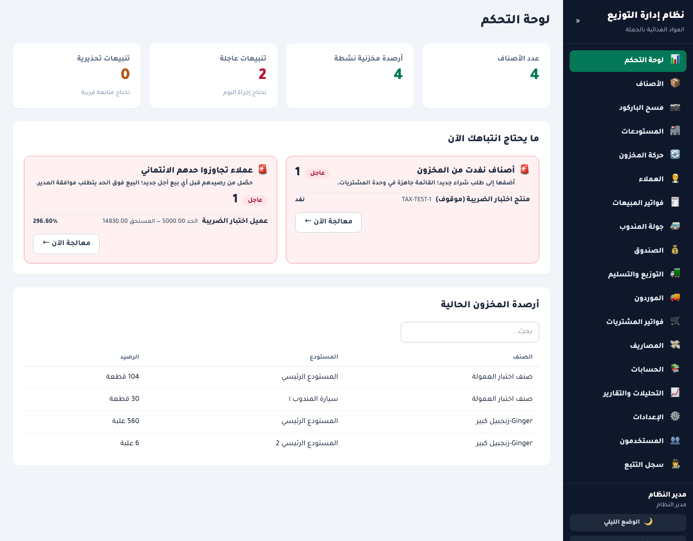

تنقسم الشاشة إلى:

- **القائمة الجانبية (يمين الشاشة):** كل وحدات النظام. **لا ترى إلا ما تسمح به صلاحياتك** — أمين المستودع مثلاً لا يرى «الحسابات» أصلاً.
- **زر الطيّ «»»:** يطوي القائمة الجانبية لتوسيع مساحة العمل. مفيد جداً في شاشات الجرد والفواتير الطويلة.
- **زر 🌙 / ☀️:** التبديل بين الوضع النهاري والليلي. النظام يتذكّر اختيارك.
- **لوحة التحكم:** أرقام سريعة (عدد الأصناف، الأرصدة النشطة، التنبيهات)، ثم **«ما يحتاج انتباهك الآن»**.

### التنبيهات: ابدأ يومك من هنا

بطاقات التنبيهات هي أهم ما في لوحة التحكم. النظام يفحص كل الوحدات ويعرض ما يستدعي تدخّلاً اليوم، مصنّفاً بثلاث درجات:

| الدرجة | المعنى | أمثلة |
|--------|--------|-------|
| 🚨 **عاجل** | يحتاج إجراءً اليوم | تشغيلات انتهت صلاحيتها، عملاء تجاوزوا الحد الائتماني |
| ⚠️ **تحذير** | يحتاج متابعة قريبة | صلاحيات تنتهي خلال 30 يوماً، أصناف تحت الحد الأدنى |
| ℹ️ **للمتابعة** | معلومة مفيدة | فواتير بانتظار التحصيل، طلبيات لم تُسلَّم |

كل بطاقة تعرض أول 5 عناصر فقط مع عبارة «و… غيرها»، وفي أسفلها زر **«معالجة الآن ←»** ينقلك مباشرة للشاشة التي تُعالَج فيها المشكلة. لن ترى بطاقة لا تملك صلاحية معالجتها.

### الجداول: البحث والترتيب والصفحات

كل جداول النظام تتصرّف بنفس الطريقة:

- **مربع البحث** فوق الجدول يبحث في كل الأعمدة فوراً.
- **الضغط على عنوان أي عمود** يرتّب تصاعدياً، والضغط مرة ثانية يعكس الترتيب.
- **كل صفحة تعرض 15 سطراً كحد أقصى** مع أزرار تنقّل أسفل الجدول.

### العمل من الجوال والتابلت

النظام يعمل على كل المقاسات: على الجوال تتحوّل القائمة الجانبية إلى قائمة منسدلة من زر ☰، وتتحوّل صفوف إدخال الأصناف من أعمدة متجاورة إلى بطاقات مستقلة يسهل لمسها.

---

## 2. الإعداد الأول — لوحة الإعدادات

**قبل إصدار أول فاتورة، اضبط هذه الشاشة.** بيانات الشركة تظهر في رأس كل مستند مطبوع، والدولة تحدّد أي الضرائب ستُعرض عليك عند البيع.

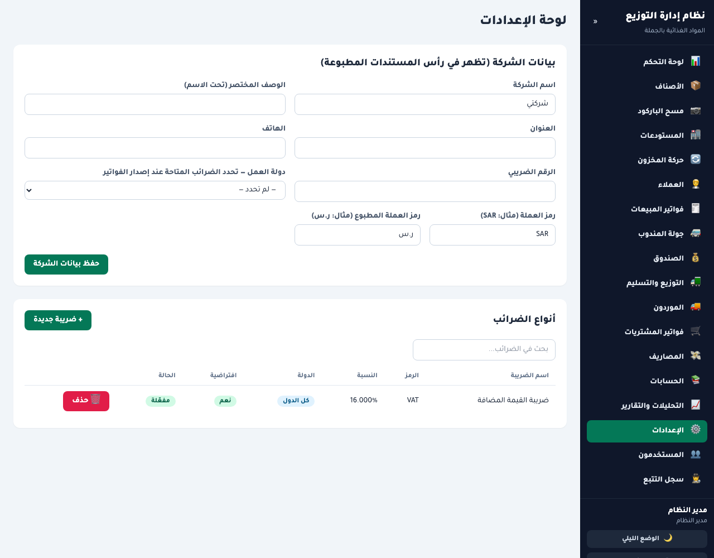

### أ) بيانات الشركة

| الحقل | الشرح |
|-------|-------|
| اسم الشركة | يظهر في رأس كل فاتورة وقائمة تجهيز مطبوعة |
| الوصف المختصر | سطر تحت الاسم، مثل «توزيع مواد غذائية بالجملة» |
| العنوان / الهاتف | بيانات التواصل المطبوعة |
| الرقم الضريبي | يظهر على الفواتير الضريبية |
| **دولة العمل** | تحدّد أي الضرائب متاحة عند إصدار الفواتير |
| **توقيت الشركة** | عليه **يبدأ يوم العمل وينتهي**؛ اضبطه أول شيء |
| رمز العملة / رمز العملة المطبوع | مثل `SAR` و `ر.س` |

**اختصار مفيد:** عند اختيار الدولة يملأ النظام العملة المناسبة لها تلقائياً — لكنه **لا يفعل ذلك إن كنت قد عدّلت العملة يدوياً**، حتى لا يُلغي اختياراً متعمّداً منك.

#### توقيت الشركة — ليس حقلاً شكلياً

كل الأوقات تُخزَّن بالتوقيت العالمي (UTC)، وهذا صحيح. لكن التقارير تُطلب **بالأيام**، واليوم مفهوم محلي. لذلك يحدّد هذا الحقل **أين يبدأ يوم العمل**: منتصف الليل بتوقيتك أنت، لا بتوقيت الخادم الذي يعمل عليه النظام.

**لماذا يهم:** لو بقي على UTC وأنت في توقيت +٣، فإن كل تحصيل يقع بين **منتصف الليل و٣ فجراً** بتوقيتك يُحسب على **اليوم السابق**، ويظهر تقرير إقفال الصندوق فارغاً والنقد في الدرج. هذا خلل حقيقي حدث فعلاً: تحصيل ٥٠٠.٠٠ الساعة ٠١:٢٦ فجراً أظهر «عدد الحركات: صفر».

> **اضبطه مرة واحدة عند التأسيس، ولا تغيّره بعد بدء العمل.** تغييره يعيد رسم حدود الأيام لكل التقارير القديمة، فحركة كانت في يوم قد تنتقل إلى اليوم المجاور. المبالغ لا تضيع، لكن مجاميع الأيام تتغيّر.

والنظام يرفض منطقة زمنية غير معروفة عند الحفظ، لأن الخطأ لو مرّ فسيظهر كتقرير فارغ — وهو ما يشبه ضياع مال، لا خطأ إدخال.

### ب) أنواع الضرائب

يدعم النظام أكثر من ضريبة في وقت واحد (ضريبة قيمة مضافة + رسم بلدي مثلاً)، وكل ضريبة لها:

- **اسم ورمز فريد** (مثل `VAT`)
- **نسبة مئوية** (16 تعني 16%)
- **الدولة التي تنطبق فيها** — وهنا الفكرة المهمة:
  - ضريبة **بلا دولة** = تنطبق دائماً في كل الحالات.
  - ضريبة **مرتبطة بدولة** = لا تُعرَض عند إصدار الفواتير إلا إذا كانت هي دولة الشركة. هذا يسمح لك بتجهيز ضرائب سوق جديد قبل دخوله، دون أن تظهر في فواتير اليوم. تظهر هذه الضرائب في الجدول بشارة **«خارج نطاق الشركة»**.
- **افتراضية:** تُقترح تلقائياً على كل فاتورة جديدة.
- **مفعّلة / موقوفة:** إيقاف ضريبة يمنع استخدامها مستقبلاً ولا يمسّ الفواتير القديمة.

اضغط على شارة «نعم/لا» أو «مفعّلة/موقوفة» مباشرة في الجدول لتبديلها بدون فتح نافذة.

> **حذف ضريبة لا يغيّر الفواتير السابقة** — كل فاتورة تحتفظ بنسخة من نسبة الضريبة التي طُبّقت عليها وقت إصدارها.

### 🔧 مثال عملي: ضبط شركة جديدة

1. اسم الشركة: `شركة النور لتوزيع المواد الغذائية`، الوصف: `المواد الغذائية بالجملة`.
2. دولة العمل: اختر دولتك → يملأ النظام العملة تلقائياً.
3. أضف ضريبة: الاسم `ضريبة القيمة المضافة`، الرمز `VAT`، النسبة `16`، الدولة: **اتركها فارغة** إن كنت تعمل في سوق واحد، وفعّل ✅ «الضريبة الافتراضية».
4. احفظ. من الآن ستُقترح هذه الضريبة تلقائياً على كل فاتورة جديدة.

---

## 3. المستخدمون والصلاحيات

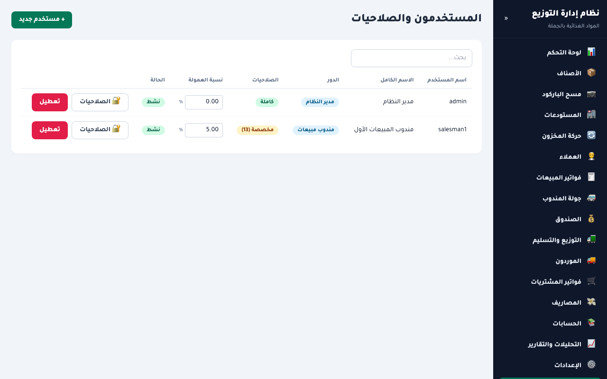

### الأدوار الستة

الدور هو **قالب صلاحيات جاهز**. عند إنشاء مستخدم اختر الدور المناسب وسيحصل تلقائياً على ما يحتاجه:

| الدور | ماذا يستطيع؟ |
|-------|--------------|
| **مدير النظام** | كل شيء، دائماً. لا يمكن حجب أي صلاحية عنه (حماية من إقفال النظام على نفسك). |
| **أمين المستودع** | الأصناف (عرض)، المستودعات، الاستلام، التحويل، الإتلاف، الجرد، والتوزيع والتسليم. |
| **موظف مبيعات / مندوب** | العملاء، إصدار الفواتير، المرتجعات، عروض الأسعار، سندات القبض، والجولة الميدانية. **يرى عملاءه فقط** ما لم تُمنح له صلاحية «الوصول لجميع العملاء». |
| **السائق** | متابعة رحلات التوزيع وتسليم الطلبيات فقط. |
| **أمين الصندوق** | التحصيل من العملاء، الصرف للموردين والمصاريف، وملخص إقفال اليوم. |
| **المحاسب** | المشتريات، الموردون، المصاريف، الحسابات والقيود، التقارير، والمطابقة البنكية. |

### تخصيص الصلاحيات لمستخدم بعينه

إذا احتجت استثناءً (مثلاً: مندوب تسمح له بالموافقة على تجاوز الحد الائتماني)، افتح المستخدم وحدّد صلاحياته يدوياً. **القائمة اليدوية تحلّ محلّ قالب الدور بالكامل**، فتأكد من تحديد كل ما يحتاجه، لا الصلاحية الإضافية وحدها.

### نسبة العمولة

حقل «نسبة العمولة %» يظهر لمندوبي المبيعات فقط، ويُستخدم في تقرير عمولات المناديب (الفصل 10).

### 🔧 مثال عملي: إضافة مندوب جديد

1. **المستخدمون** ← **+ مستخدم جديد**.
2. اسم المستخدم `salem` (بأحرف إنجليزية)، الاسم الكامل `سالم العتيبي`، كلمة مرور من 8 أحرف فأكثر.
3. الدور: **موظف مبيعات**. نسبة العمولة: `2.5`.
4. احفظ، ثم اذهب إلى **العملاء** وأسنِد له عملاءه (حقل «المندوب المسؤول» في بطاقة كل عميل).
5. إن كانت له سيارة توزيع، اذهب إلى **المستودعات** وأسنِد المركبة إليه (الفصل 5).

---

## 4. الأصناف والأسعار والباركود

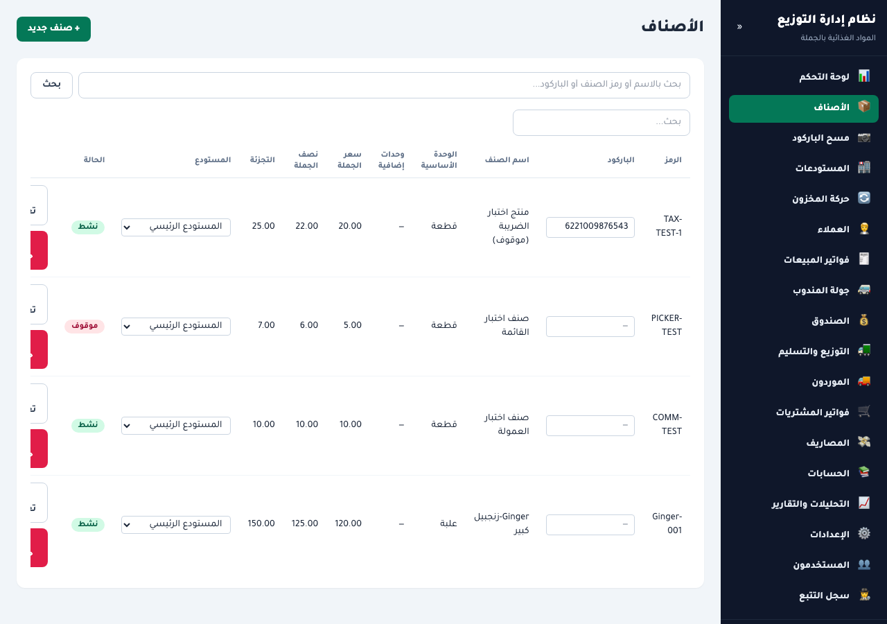

### بطاقة الصنف

| الحقل | ملاحظات |
|-------|---------|
| رمز الصنف (SKU) | معرّف فريد داخلي |
| الباركود | اختياري، لكنه يُسرّع البيع والجرد كثيراً |
| اسم الصنف | الاسم الظاهر في الفواتير |
| **الوحدة الأساسية** | أصغر وحدة تتعامل بها (حبة، عبوة، كجم). **كل الأرصدة تُحفظ بها.** |
| الحد الأدنى للمخزون | تحته يظهر الصنف في تنبيهات لوحة التحكم واقتراحات إعادة الطلب |
| المستودع | المستودع الافتراضي الذي يُباع منه الصنف |
| سعر الجملة / نصف الجملة / التجزئة | ثلاثة أسعار للوحدة الأساسية |

### الوحدات المتعددة (UoM)

بعد حفظ الصنف يمكنك إضافة وحدات أكبر بمعامل تحويل ثابت، مثل: `كرتونة = 12 حبة`. عندها يستطيع البائع أن يكتب «3 كراتين» وسيخصم النظام 36 حبة من الرصيد تلقائياً.

### فئات الأسعار الثلاث

السعر لا يُختار يدوياً في العادة: كل عميل له **فئة سعر** (جملة / نصف جملة / تجزئة)، والنظام يجلب السعر المناسب تلقائياً عند اختيار العميل في الفاتورة.

### إيقاف الصنف بدلاً من حذفه

الصنف الموقوف يختفي من قوائم اختيار الأصناف في الفواتير الجديدة، لكنه يبقى في كل الفواتير والتقارير السابقة. **هذا هو التصرّف الصحيح لصنف توقّفت عن بيعه.** الحذف النهائي متاح لكنه مخصّص للأصناف التي أُدخلت بالخطأ ولم تتحرك أبداً.

### مسح الباركود

شاشة **مسح الباركود** تفتح كاميرا الجهاز؛ وجّهها إلى باركود المنتج فيعرض النظام بطاقة الصنف ورصيده فوراً. مفيدة في المستودع للتحقّق من صنف بيدك.

### 🔧 مثال عملي: إضافة صنف بوحدتين

نريد إدخال **زيت دوار الشمس 5 لتر**، يُشترى ويُباع بالعبوة وبالكرتونة (4 عبوات).

1. **الأصناف** ← **+ صنف جديد**.
2. SKU: `OIL-SUN-5L` — الباركود: `6281000123456` — الاسم: `زيت دوار الشمس 5 لتر`.
3. الوحدة الأساسية: `عبوة` — الحد الأدنى: `48` — المستودع: `المستودع الرئيسي`.
4. الأسعار للعبوة: جملة `20.00`، نصف جملة `22.00`، تجزئة `25.00`.
5. احفظ، ثم أضف وحدة: الاسم `كرتونة`، معامل التحويل `4`.

النتيجة: بيع «كرتونتين» لعميل جملة = 8 عبوات × 20 = **160.00 ر.س**، ويُخصم من الرصيد 8 عبوات.

---

## 5. المستودعات والمركبات

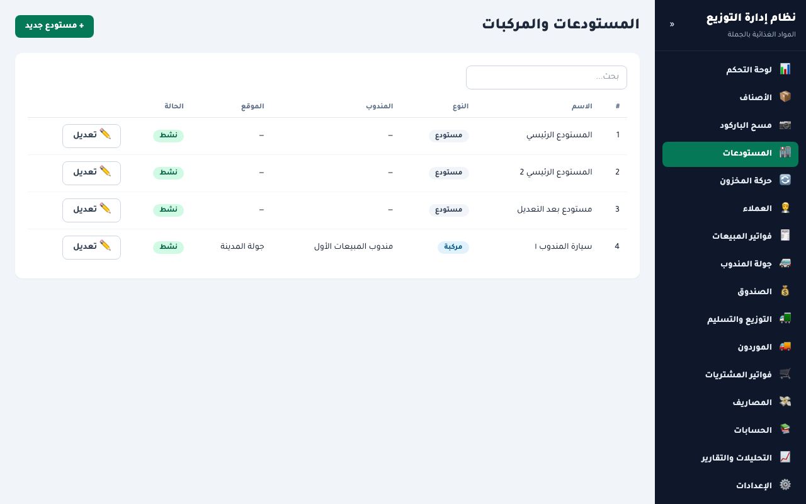

في هذا النظام **سيارة المندوب هي مستودع متنقّل**. هذا القرار التصميمي يعني أن كل ما تعرفه عن المستودعات ينطبق على السيارة بلا استثناء: لها رصيد، وتُحمّل بتحويل عادي، وتُجرَد في آخر اليوم، وتخضع لقاعدة FEFO.

### إنشاء مستودع

اسم + موقع (اختياري). هذا كل شيء للمستودع الثابت.

### تعليم مستودع كمركبة

فعّل ✅ **«مركبة (سيارة مندوب)»**، ثم اختر **المندوب المسؤول** من القائمة. القائمة تعرض **موظفي المبيعات النشطين فقط** — فلا يمكن إسناد سيارة لمحاسب أو لموظف موقوف.

في جدول المستودعات تميّز المركبة بشارة زرقاء **«مركبة»**، وإذا كانت بلا مندوب تظهر شارة صفراء **«بدون إسناد»** — وهي حالة تستحق الانتباه، لأن السيارة غير المسندة لا يمكن البيع منها.

### 🔧 مثال عملي: تجهيز سيارة توزيع لجولة الصباح

1. **المستودعات** ← **+ مستودع جديد** ← الاسم `سيارة سالم — أ ب ج 1234` ← ✅ مركبة ← المندوب: `سالم العتيبي` ← حفظ.
2. **حركة المخزون** ← **تحويل بين المستودعات**: من `المستودع الرئيسي` إلى `سيارة سالم`، 20 كرتونة زيت + 15 كيس أرز.
3. المندوب يفتح تطبيق الجولة على جواله فيجد البضاعة في سيارته جاهزة للبيع (الفصل 13).
4. في نهاية اليوم: **حركة المخزون** ← **الجرد** على السيارة (الفصل 8)، ثم **تسوية الجولات** لإقفال اليوم وتوثيق أي فرق (الفصل 14).

---

## 6. الموردون

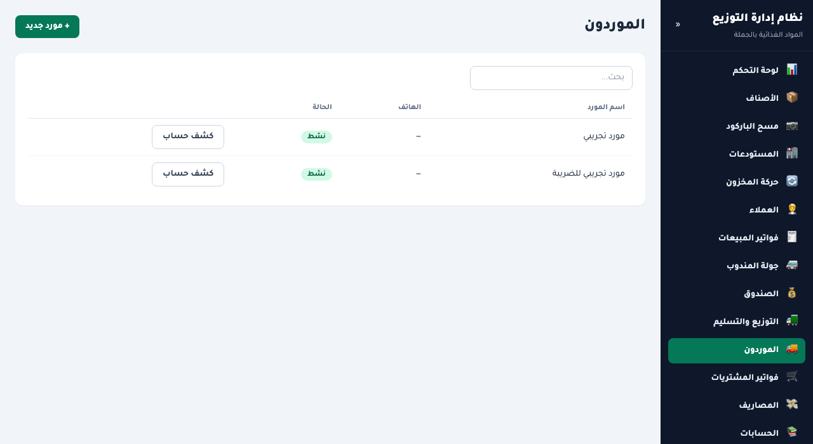

بطاقة المورد بسيطة: الاسم، الهاتف، العنوان، و**رصيد افتتاحي** إن كنت مديناً له بمبلغ قبل بدء استخدام النظام.

من بطاقة المورد تصل إلى:

- **كشف الحساب:** كل فواتير الشراء والمرتجعات والمدفوعات بترتيب زمني مع الرصيد المتحرّك.
- **سند صرف:** تسجيل دفعة للمورد نقداً أو بتحويل بنكي، فيُنشئ النظام القيد المحاسبي تلقائياً ويُنقص رصيده.

---

## 7. المشتريات: من طلب الشراء إلى الاستلام

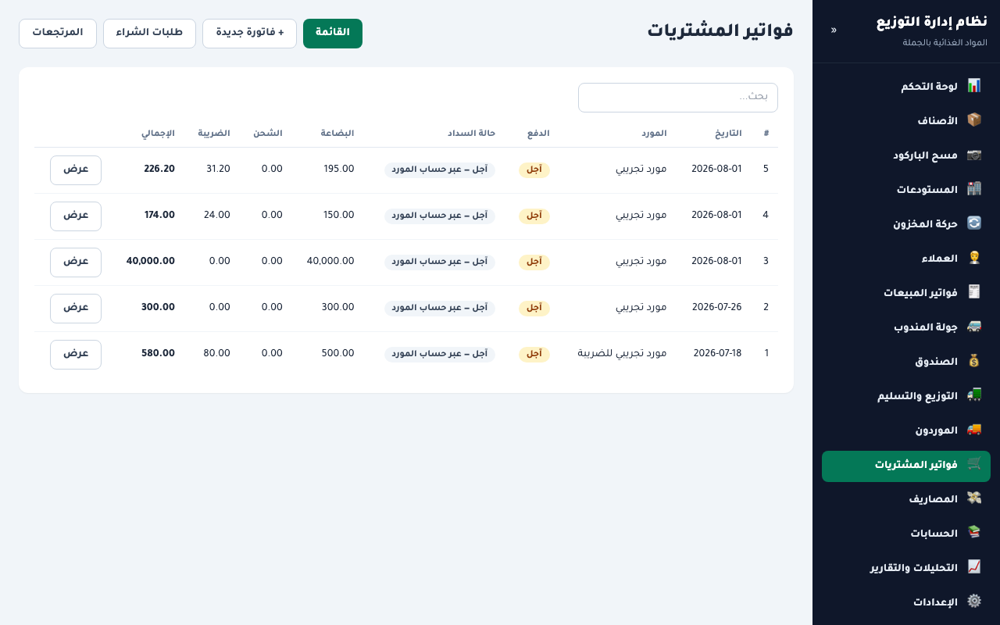

تنقسم الشاشة إلى أربع تبويبات: **القائمة**، **+ فاتورة جديدة**، **طلبات الشراء**، **المرتجعات**.

### الدورة الكاملة

```
اقتراح إعادة الطلب  →  طلب شراء  →  إرسال للمورد  →  استلام (كلي أو جزئي)  →  فاتورة شراء
```

### أ) طلبات الشراء واقتراحات إعادة الطلب

تبويب **طلبات الشراء** يعرض زر **اقتراحات إعادة الطلب**: النظام يقارن الأرصدة الحالية بالحدود الدنيا ويقترح ما يجب طلبه ومن أي مورد اشتريته آخر مرة. يمكنك تحويل الاقتراحات إلى طلب شراء بضغطة.

حالات طلب الشراء: **مسودة** ← **مُرسَل** ← **مستلَم جزئياً** / **مستلَم بالكامل** (أو **ملغى**).

الاستلام الجزئي مدعوم: إن وصلت 60 كرتونة من أصل 100، سجّل 60 ويبقى الطلب مفتوحاً بـ 40.

### ب) فاتورة الشراء — والصلاحيات إلزامية

**كل سطر بضاعة داخلة يجب أن يحمل رقم تشغيلة وتاريخ انتهاء.** لا يقبل النظام إدخال مادة غذائية بدونهما، لأن هذا هو أساس تتبّع الصلاحية وقاعدة FEFO كلها.

عناصر الفاتورة:

- **البضاعة:** مجموع الأسطر.
- **الشحن:** يُضاف إلى الإجمالي، و**يُرحَّل إلى حساب المخزون** — أي أنه يُحتسب جزءاً من تكلفة البضاعة، لا مصروفاً منفصلاً.
- **الضريبة:** تُحسب على قيمة البضاعة (لا على الشحن)، ويمكن اختيار أكثر من ضريبة.
- **طريقة الدفع:** نقدي (يبقى بانتظار الصرف من الصندوق) أو آجل (يُقيَّد على حساب المورد).

### ج) مرتجعات المشتريات

تبويب **المرتجعات** لإرجاع بضاعة للمورد. اختر الفاتورة الأصلية والأسطر والكميات، فيُخصم المخزون ويُخفَّض رصيد المورد بقيد عكسي تلقائي.

### 🔧 مثال عملي: استلام توريدة زيت

**الطلب:** 100 كرتونة زيت (400 عبوة) بسعر 16.00 ر.س للعبوة، شحن 200 ر.س، ضريبة 16%.

1. **فواتير المشتريات** ← **+ فاتورة جديدة**.
2. المورد: `مصنع الزيوت الوطني` — التاريخ: تاريخ اليوم — الدفع: `آجل`.
3. السطر: الصنف `زيت دوار الشمس 5 لتر` — الوحدة `كرتونة` — الكمية `100` — سعر الوحدة `64.00`
   *(الكرتونة = 4 عبوات × 16.00)*
4. **رقم التشغيلة:** `L-2026-114` — **تاريخ الانتهاء:** `2027-03-01`.
5. الشحن: `200.00` — الضريبة: ✅ ضريبة القيمة المضافة.

**الأرقام التي سيعرضها النظام:**

| البند | القيمة |
|-------|--------|
| البضاعة | 6,400.00 |
| الشحن | 200.00 |
| الضريبة (16% من 6,400) | 1,024.00 |
| **الإجمالي** | **7,624.00** |

**والقيد المحاسبي الذي يُنشأ تلقائياً:**

| الحساب | مدين | دائن |
|--------|------|------|
| 1030 — المخزون *(بضاعة + شحن)* | 6,600.00 | |
| 2020 — الضريبة | 1,024.00 | |
| 2010 — ذمم دائنة (المورد) | | 7,624.00 |

ودخل المخزون 400 عبوة بتشغيلة `L-2026-114` تنتهي في `2027-03-01`.

---

## 8. حركة المخزون: التحويل والإتلاف والجرد

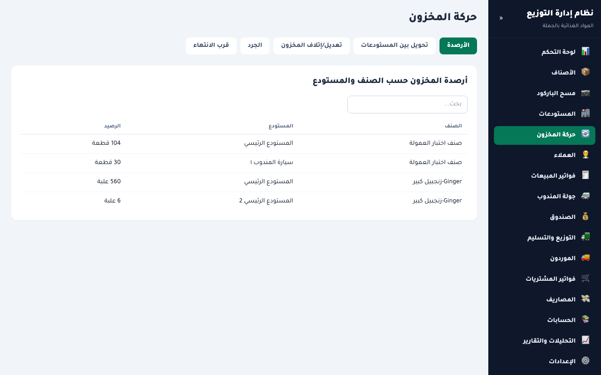

خمس تبويبات: **الأرصدة**، **تحويل بين المستودعات**، **تعديل/إتلاف المخزون**، **الجرد**، **قرب الانتهاء**.

### قاعدة FEFO — الوارد أولاً منتهي الصلاحية أولاً يُصرف أولاً

عند بيع أي صنف، **لا تختار أنت التشغيلة**. يرتّب النظام تشغيلات الصنف تصاعدياً حسب تاريخ الانتهاء ويخصم من الأقرب انتهاءً أولاً، موزّعاً الكمية على أكثر من تشغيلة عند الحاجة. هذه القاعدة هي ما يقلّل الهدر في المواد الغذائية، وهي مطبّقة في كل مكان: الفواتير العادية، وبيع السيارة، والتحويلات.

### أ) الأرصدة

الرصيد الحالي لكل صنف في كل مستودع (بما فيها سيارات المناديب) بالوحدة الأساسية.

### ب) التحويل بين المستودعات

انقل كميات من مستودع لآخر. الاستخدام اليومي الأهم: **تحميل سيارة المندوب صباحاً**.

### ج) تعديل / إتلاف المخزون

لتسجيل التالف أو الفاقد أو التصحيح. صنّف السبب (تالف، منتهي الصلاحية، فاقد…) وأضف ملاحظة. النظام يُنقص المخزون ويُرحّل التكلفة إلى حساب **5030 — خسائر التلف**.

**الإلغاء متاح:** إن سجّلت إتلافاً بالخطأ، فزر الإلغاء يُعيد الكمية إلى المخزون ويعكس القيد المحاسبي — ولا يمحو السجل الأصلي، بل يضع عليه علامة «ملغى» مع اسم من ألغاه ووقته.

### د) الجرد الفعلي (Stocktake)

الجرد يمرّ بثلاث خطوات واضحة:

1. **فتح جرد:** اختر المستودع، فيلتقط النظام «صورة» للأرصدة الدفترية لحظتها (الكمية المتوقعة لكل تشغيلة).
2. **إدخال العدّ:** أدخل الكمية المعدودة فعلياً لكل سطر. يمكنك الحفظ والعودة لاحقاً — الجرد يبقى مفتوحاً.
3. **ترحيل الجرد:** يُطبّق النظام **الفروقات فقط** على الأرصدة، ويُنشئ قيداً محاسبياً واحداً صافياً على حساب **5040 — فروقات الجرد**.

> **مهم:** لأن النظام يُطبّق الفرق (لا الكمية المطلقة)، فإن أي بيع يحدث أثناء فترة الجرد لا يُلغى ولا يُداس عليه.

الجرد المفتوح يمكن إلغاؤه قبل ترحيله دون أي أثر. وبعد الترحيل يمكن طباعة محضر الجرد.

### هـ) قرب الانتهاء

قائمة التشغيلات التي تنتهي صلاحيتها خلال 30 يوماً، مرتّبة بالأقرب. استخدمها لتخطيط العروض والتصريف قبل أن تتحوّل إلى خسارة.

### 🔧 مثال عملي: جرد سيارة المندوب آخر اليوم

الدفاتر تقول إن في سيارة سالم 5 كراتين زيت، والعدّ الفعلي أظهر 4.

1. **حركة المخزون** ← **الجرد** ← **فتح جرد** ← المستودع: `سيارة سالم`.
2. في سطر الزيت: الكمية المتوقعة `20 عبوة` ← أدخل الكمية المعدودة `16 عبوة`.
3. **حفظ العدّ** ← راجع عمود الفرق: `4- عبوات`.
4. **ترحيل الجرد**.

**النتيجة:** ينزل رصيد السيارة إلى 16 عبوة، ويُنشأ قيد بتكلفة العبوات الأربع:

| الحساب | مدين | دائن |
|--------|------|------|
| 5040 — فروقات الجرد | 64.00 | |
| 1030 — المخزون | | 64.00 |

*(بافتراض تكلفة 16.00 للعبوة)*

---

## 9. العملاء والحدود الائتمانية

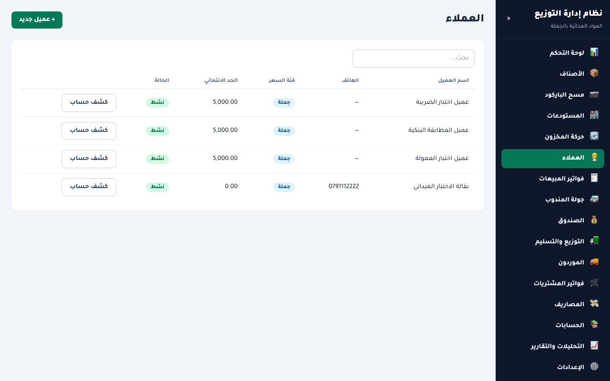

### بطاقة العميل

| الحقل | الشرح |
|-------|-------|
| الاسم / الهاتف / العنوان | بيانات المحل |
| **فئة السعر** | جملة / نصف جملة / تجزئة — تحدّد السعر المجلوب تلقائياً في الفواتير |
| **الحد الائتماني** | أقصى مديونية مسموحة لهذا العميل |
| **المندوب المسؤول** | المندوب الذي يخدم هذا العميل |

### كيف يعمل الحد الائتماني؟

عند إصدار فاتورة **آجلة**، يجمع النظام رصيد العميل الحالي + قيمة الفاتورة الجديدة. إن تجاوز المجموع الحد الائتماني **رُفضت الفاتورة** برسالة واضحة تبيّن الرصيد والحد والمبلغ الزائد.

من يملك صلاحية **«الموافقة على تجاوز الحد الائتماني»** يستطيع تجاوز هذا المنع. الفواتير النقدية لا تخضع للحد أصلاً لأنها لا تُنشئ مديونية.

### كشف الحساب وسند القبض

من بطاقة العميل تفتح **كشف الحساب** (الفواتير والمرتجعات والدفعات مع الرصيد المتحرّك)، وتُسجّل **سند قبض** بمبلغ وطريقة دفع، فيُنشئ النظام القيد المحاسبي ويُنقص المديونية.

### 🔧 مثال عملي: عميل يقترب من حدّه الائتماني

`بقالة الأمل` — فئة السعر: جملة — الحد الائتماني: `5,000.00` — الرصيد الحالي: `4,600.00`.

- محاولة إصدار فاتورة آجلة بـ `800.00` → **مرفوضة**: المجموع 5,400 يتجاوز الحد بـ 400.
- الحلول الثلاثة: (1) تحصيل دفعة أولاً بسند قبض، أو (2) إصدارها **نقدية**، أو (3) موافقة مدير يملك صلاحية التجاوز.

---

## 10. المبيعات: عرض السعر، الفاتورة، الخصم، المرتجع

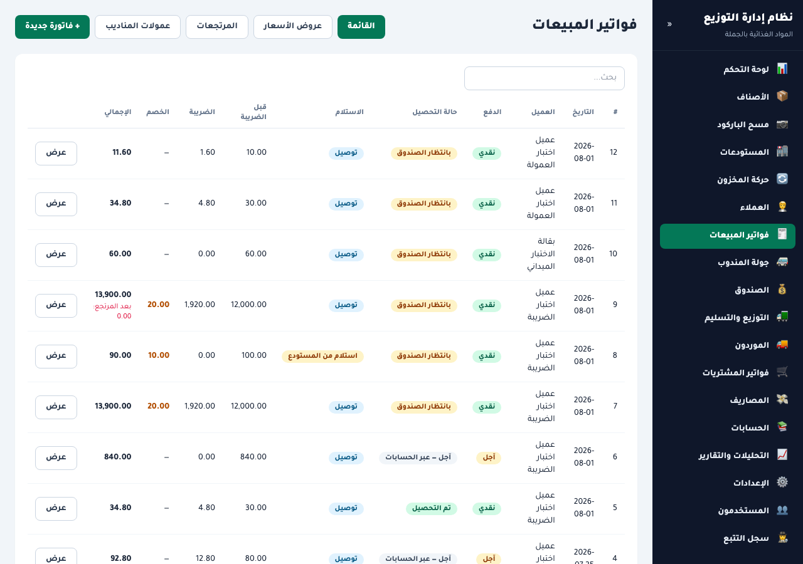

التبويبات: **القائمة**، **المسودات**، **عروض الأسعار**، **المرتجعات**، **عمولات المناديب**، وزر **+ فاتورة جديدة**.

### أ) إصدار فاتورة

1. **اختر العميل** → يجلب النظام فئة سعره تلقائياً.
2. **أضف الأسطر:** الصنف، الوحدة، الكمية. السعر يأتي تلقائياً ويمكن تعديله إن كانت لديك الصلاحية.
3. **اختر الضرائب** (المفعّلة والافتراضية تكون مؤشَّرة مسبقاً).
4. **طريقة الدفع:** نقدي / بطاقة / آجل.
5. **إتمام الفاتورة**.

عند الإتمام يقوم النظام بكل هذا **في عملية واحدة لا تتجزأ** — إما أن تنجح كلها أو لا يُحفظ منها شيء:

- التحقق من الحد الائتماني (في الآجل)
- خصم المخزون بقاعدة FEFO من التشغيلات الأقرب انتهاءً
- إنشاء قيد الإيراد وقيد تكلفة البضاعة المباعة
- تجهيز الفاتورة للطباعة

### ب) الخصم — بطريقة «المبلغ المطلوب تحصيله»

هذه واحدة من أذكى تفاصيل النظام. عند الضغط على «إتمام» تظهر نافذة تعرض الإجمالي، وفيها حقل **«المبلغ المطلوب تحصيله»**. اكتب المبلغ الذي ستقبضه فعلاً، **والفرق يُسجَّل خصماً تلقائياً**.

بجانب الحقل أزرار **تدوير سريع** (لأقرب 1، 5، 10، 50، 100) وزر **«بدون خصم»**. هكذا يتحوّل «خلّها 12,000 بدل 12,005» إلى نقرة واحدة موثّقة محاسبياً.

> الخصم يُرحَّل إلى حساب **4030 — خصم مسموح به** (حساب مقابل للإيراد)، فيظهر أثره صحيحاً في قائمة الدخل.

**ترتيب الحساب مهم:** الضريبة تُحسب على الإجمالي **قبل** الخصم، ثم يُطرح الخصم من الإجمالي النهائي.

### ج) المسودات المتعددة

يمكنك فتح أكثر من فاتورة قيد التحضير في نفس الوقت والتنقّل بينها من تبويب **المسودات (n)** — مفيد عندما يقاطعك عميل آخر على الهاتف. النظام ينبّهك قبل مغادرة الصفحة إن كان فيها عمل غير محفوظ.

### د) عروض الأسعار

تبويب **عروض الأسعار** لإصدار عرض بصلاحية زمنية. العرض **لا يمسّ المخزون ولا الحسابات**. إن وافق العميل، حوّله بضغطة واحدة إلى فاتورة تُطبَّق عليها كل قواعد البيع (FEFO، الائتمان، القيود).

### هـ) مرتجعات المبيعات

اختر الفاتورة الأصلية والأسطر والكميات، ثم **صنّف المرتجع**:

| التصنيف | الأثر على المخزون |
|---------|-------------------|
| صالح لإعادة البيع | يعود إلى المخزون بتشغيلته الأصلية |
| تالف بسبب العميل | لا يعود للمخزون، يُسجَّل خسارة |
| تالف بسبب النقل | لا يعود للمخزون، يُسجَّل خسارة |

**والخصم يُعامَل بعدل:** إذا كانت الفاتورة الأصلية عليها خصم، يُعيد النظام **حصّة المرتجع من الخصم فقط** — لأن العميل لم يدفع تلك الحصّة أصلاً. ومجموع حصص المرتجعات الجزئية يساوي دائماً خصم الفاتورة بالضبط، لا أكثر.

**إلغاء مرتجع سُجّل بالخطأ:** في تبويب «المرتجعات» زرّ **إلغاء** أمام كل مرتجع مُثبَّت. الإلغاء يفعل ثلاثة أشياء معاً: يسحب الكمية من المخزون، ويعكس القيد المحاسبي، وتعود الفاتورة مستحقّة بكاملها عند الصندوق. والسجل **لا يُحذف** — يبقى بعلامة «ملغى» مع سبب الإلغاء، لأن الخطأ نفسه جزء من التوثيق، ولأن كشف حساب اختفى منه سطر هو كشف لا يمكن شرحه للعميل.

والصلاحية عند **المحاسب** لا المندوب: من يسجّل المرتجع ليس من يُلغيه، كما أن من يجرد المخزون ليس من يعتمد الجرد.

ويرفض النظام الإلغاء في حالتين:

| الحالة | السبب |
|--------|-------|
| رُدّ المبلغ للعميل نقداً من الصندوق | العميل يحمل النقد؛ الإلغاء يحوّل التصحيح إلى دَين لم يُبلَّغ به. استرجع المبلغ أولاً |
| بِيعت البضاعة بعد إرجاعها | لا يوجد ما يُسحب من الرفّ؛ يظهر لك رقم المتوفر والمطلوب |

> أما لو كان القرار «يُردّ نقداً» مسجَّلاً ولم يُصرف بعد، فالإلغاء ما زال ممكناً، وتُلغى معه المطالبة تلقائياً.

### و) عمولات المناديب

تقرير يعرض لكل مندوب: مبيعاته خلال الفترة، ونسبته، وقيمة عمولته المستحقّة.

### 🔧 مثال عملي: فاتورة بخصم تدوير

`بقالة الأمل` (جملة) تشتري 10 كراتين زيت + 5 أكياس أرز.

| السطر | الكمية | السعر | الإجمالي |
|-------|--------|-------|----------|
| زيت دوار الشمس 5 لتر (كرتونة = 4 عبوات) | 10 | 80.00 | 800.00 |
| أرز بسمتي 10 كجم (كيس) | 5 | 45.00 | 225.00 |
| | | **قبل الضريبة** | **1,025.00** |
| | | ضريبة 16% | 164.00 |
| | | **إجمالي الفاتورة** | **1,189.00** |

عند «إتمام الفاتورة» اضغط زر التدوير السريع **1,150** → يُسجَّل خصم **39.00** ويصبح المطلوب تحصيله **1,150.00**.

**القيد المحاسبي الناتج:**

| الحساب | مدين | دائن |
|--------|------|------|
| 1020 — ذمم العملاء | 1,150.00 | |
| 4030 — خصم مسموح به | 39.00 | |
| 4010 — إيرادات المبيعات | | 1,025.00 |
| 2020 — الضريبة المحصلة | | 164.00 |

**وقيد ثانٍ منفصل لتكلفة البضاعة المباعة** (مدين 5010 / دائن 1030) بقيمة تكلفة الكميات المخصومة فعلياً من التشغيلات حسب FEFO.

---

## 11. الصندوق: التحصيل والصرف وإقفال اليوم

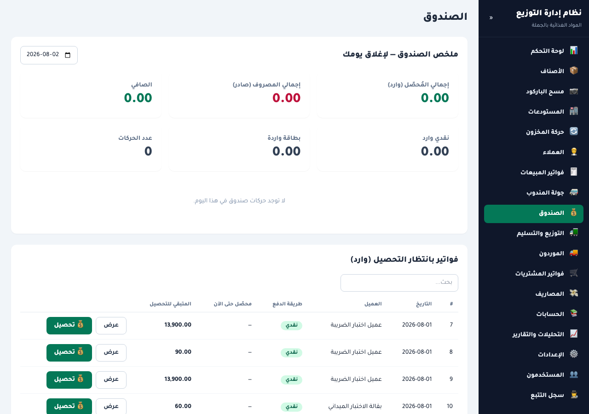

الصندوق هو **بوابة النقد**: كل مبلغ يدخل أو يخرج يمرّ من هنا، وهذا ما يجعل رصيد الصندوق في الدفاتر مطابقاً للنقد في الدرج.

### القاعدة الأساسية: الفاتورة النقدية لا تُسلَّم قبل التحصيل

عند إصدار فاتورة **نقدية أو ببطاقة**، تدخل حالة **«بانتظار الصندوق»**. ولن تظهر في شاشة التوزيع والتسليم — أي **لا يمكن تحميلها على سيارة أو تسليمها للعميل** — حتى يؤكّد أمين الصندوق قبض المبلغ.

الفواتير الآجلة لا تمرّ بهذه البوابة؛ حالتها **«آجل — عبر الحسابات»** وتذهب للتسليم مباشرة.

### التحصيل الجزئي

يمكن تحصيل جزء من المبلغ الآن والباقي لاحقاً؛ الجدول يعرض «المحصّل حتى الآن» و«المتبقي للتحصيل»، وتبقى الفاتورة في القائمة حتى تكتمل.

### الصرف من الصندوق

نفس الشاشة تعرض **المستحقات الصادرة**: فواتير المشتريات النقدية والمصاريف المسجّلة بانتظار الصرف. الصرف من هنا يضمن أن كل خروج نقدي مقيَّد.

### ملخص إقفال اليوم

في أعلى الشاشة، مع منتقي تاريخ:

- **إجمالي المُحصَّل (وارد)** — مقسوماً إلى **نقدي وارد** و**بطاقة واردة**
- **إجمالي المصروف (صادر)**
- **الصافي** — وهو ما يجب أن يكون في الدرج
- **عدد الحركات** — وتحته سجل تفصيلي بكل حركة

> **حدود اليوم تتبع «توقيت الشركة»** في لوحة الإعدادات (الفصل 2) — من منتصف الليل بتوقيتكم إلى منتصف الليل التالي. إن رأيت التقرير فارغاً بينما حصّلت فعلاً، فأول ما تتحقق منه هو أن هذا الحقل مضبوط على توقيت بلدكم لا على UTC.

### 🔧 مثال عملي: إقفال يوم في الصندوق

خلال اليوم: 3 فواتير نقدية (1,150 + 340 + 610)، وفاتورة ببطاقة (900)، وصرف مصروف وقود (250)، ودفعة لمورد (1,000).

1. حصّل الفواتير الأربع من **فواتير بانتظار التحصيل**.
2. اصرف المصروف والدفعة من **المستحقات الصادرة**.
3. راجع الملخص:

| البند | المبلغ |
|-------|--------|
| نقدي وارد | 2,100.00 |
| بطاقة واردة | 900.00 |
| **إجمالي المحصّل** | **3,000.00** |
| إجمالي المصروف | 1,250.00 |
| **الصافي** | **1,750.00** |

4. عُدّ النقد في الدرج. يجب أن يساوي **الصافي ناقص البطاقة** = 2,100 − 1,250 = **850.00 ر.س** نقداً، وأن يكون 900.00 قد ذهب لحساب البطاقات.

---

## 12. التوزيع والتسليم

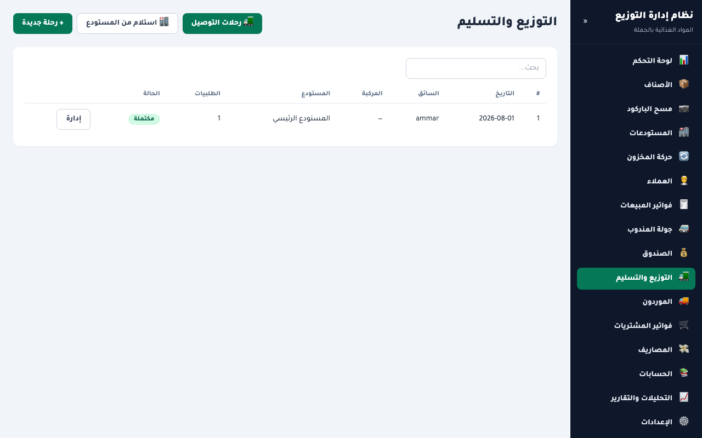

### مسارا التسليم

| المسار | متى؟ |
|--------|------|
| **رحلة توزيع** | البضاعة تُحمَّل على سيارة وتُوصَّل لمحلات العملاء |
| **استلام من المستودع** | العميل يأتي بنفسه ويستلم من عندنا |

### رحلة التوزيع خطوة بخطوة

1. **رحلة توزيع جديدة:** اسم السائق، المركبة (اختياري)، ومستودع التحميل.
2. **إضافة الفواتير للرحلة:** لا تُعرض إلا الفواتير الجاهزة فعلاً (الآجلة، والنقدية بعد تحصيلها).
3. **طباعة قائمة التجهيز (Picking List):** ورقة مرتّبة حسب موقع الأصناف في المستودع، يمشي بها العامل ويجمع الطلبيات.
4. **التسليم:** يؤشّر السائق على كل طلبية عند تسليمها، فتُحدَّث حالتها لحظياً.

### 🔧 مثال عملي: رحلة صباحية

1. **التوزيع والتسليم** ← **رحلة توزيع جديدة**: السائق `أحمد`، المركبة `أ ب ج 5678`، المستودع `المستودع الرئيسي`.
2. أضف 6 فواتير لعملاء حيّ الشمال.
3. **طباعة قائمة التجهيز** → يجمع عامل المستودع البضاعة ويحمّلها.
4. أثناء الجولة: يؤشّر أحمد «تم التسليم» عند كل محل.
5. آخر اليوم: أي فاتورة لم تُسلَّم تبقى ظاهرة في القائمة وفي تنبيهات لوحة التحكم.

---

## 13. جولة المندوب — التطبيق الميداني بدون إنترنت

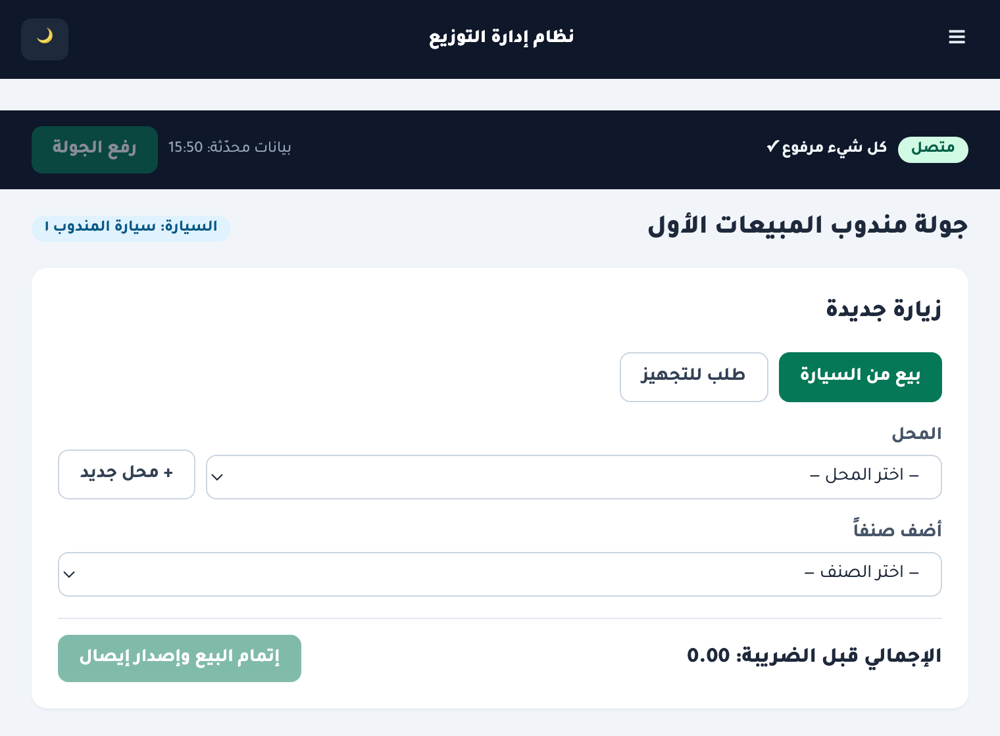

هذه الشاشة مصمّمة للجوال وتعمل **بدون إنترنت**. يفتحها المندوب صباحاً وهو متصل، فتُحمَّل بيانات جولته (العملاء، الأصناف، رصيد سيارته، الضرائب) وتُخزَّن على الجهاز؛ وبعدها يستطيع العمل طوال اليوم في مناطق بلا تغطية.

يمكن **تثبيت التطبيق على الشاشة الرئيسية** للجوال ليعمل كتطبيق مستقل.

### الشريط العلوي — حالة الجولة

| المؤشّر | المعنى |
|---------|--------|
| **متصل** / **بدون اتصال** | حالة الشبكة الآن |
| **ن بانتظار الرفع** | عدد المستندات المحفوظة على الجهاز ولم تصل الخادم بعد |
| **(ن مرفوض)** | مستندات رفضها الخادم مع سبب الرفض |
| **كل شيء مرفوع ✓** | لا يوجد عمل معلّق |
| **بيانات محدّثة: 15:50** | وقت آخر تحديث للبيانات المخزّنة |
| **رفع الجولة** | رفع يدوي فوري |

### نمطا العمل

- **بيع من السيارة:** بيع مباشر يخصم من رصيد سيارة المندوب.
- **طلب للتجهيز:** أخذ طلبية تُجهَّز من المستودع لاحقاً (لا تمسّ رصيد السيارة).

المندوب الذي لا سيارة مسندة له يستطيع أخذ الطلبات فقط، وتظهر له شارة **«لا توجد سيارة مسندة — الطلبات فقط»**.

### تسجيل محل جديد من الميدان

زر **«+ محل جديد»** يسجّل العميل محلياً ويُسنده لجولة المندوب، ويمكن البيع له **فوراً** في نفس الزيارة دون انتظار الاتصال.

### الإيصال المؤقّت

رقم الفاتورة الرسمي لا يوجد قبل وصول المستند للخادم. لذلك يُعطى العميل **إيصالاً بمرجع مؤقّت** على شكل `FLD-XXXXXXXX` — بشكل مختلف عمداً عن أرقام الفواتير الرسمية حتى لا يُخلط بينهما. بعد المزامنة يحصل المستند على رقمه النهائي.

### المزامنة: لماذا هي آمنة؟

- **لا يُحذف مستند من الطابور إلا بعد تأكيد الخادم استلامه.**
- كل مستند يحمل **معرّفاً فريداً يُولَّد على الجهاز**. لو انقطع الاتصال بعد وصول المستند وقبل وصول الرد، سيُرسله التطبيق مرة أخرى، **وسيتعرّف عليه الخادم كمستند سبق استلامه فلا يُكرّره**. لا فواتير مكرّرة، ولا مخزون يُخصم مرتين.
- المزامنة تنطلق تلقائياً عند عودة الشبكة، **وعند فتح التطبيق مجدداً** — فلو نفدت بطارية الجوال في منتصف الجولة، يكفي إعادة فتح التطبيق ليُرفع كل شيء.
- المستند المرفوض **يبقى في الطابور مع سبب الرفض** ولا يُفقد أبداً.

> إذا ظهرت شارة حمراء **«التخزين المحلي غير متاح»** فهذا يعني أن متصفّح الجهاز يمنع الحفظ المحلي (تصفّح خاص مثلاً). التطبيق سيعمل لكن **بالاتصال فقط** — أغلق وضع التصفّح الخاص قبل بدء الجولة.

### 🔧 مثال عملي: يوم كامل لمندوب

**7:30 صباحاً (في المكتب، متصل):** يفتح سالم شاشة الجولة → تظهر «بيانات محدّثة» ورصيد سيارته.

**10:15 (منطقة بلا تغطية):**
- `بقالة الأمل`: **بيع من السيارة** — 3 كراتين زيت = 240.00 + ضريبة 38.40 = **278.40**. يسلّمها البضاعة ويعطيه الإيصال `FLD-8A3C91D0`. الشريط يعرض «1 بانتظار الرفع».
- `سوبرماركت الواحة` (محل جديد): **+ محل جديد** → يسجّله → **طلب للتجهيز** 20 كيس أرز. الشريط يعرض «3 بانتظار الرفع» (المحل + البيع + الطلب).

**1:40 ظهراً (عادت الشبكة):** ترفع المزامنة تلقائياً. تظهر رسالة **«تم رفع 3»** والشريط يصبح **«كل شيء مرفوع ✓»**.

**النتيجة على الخادم:** عميل جديد باسم `سوبرماركت الواحة` مُسنَد لسالم، فاتورة برقم رسمي خُصمت من رصيد السيارة بقاعدة FEFO، وطلبية بانتظار التجهيز من المستودع الرئيسي.

**5:00 مساءً:** جرد السيارة (الفصل 8) ثم **إقفال الجولة** (الفصل 14).

---

## 14. تسوية جولات المناديب

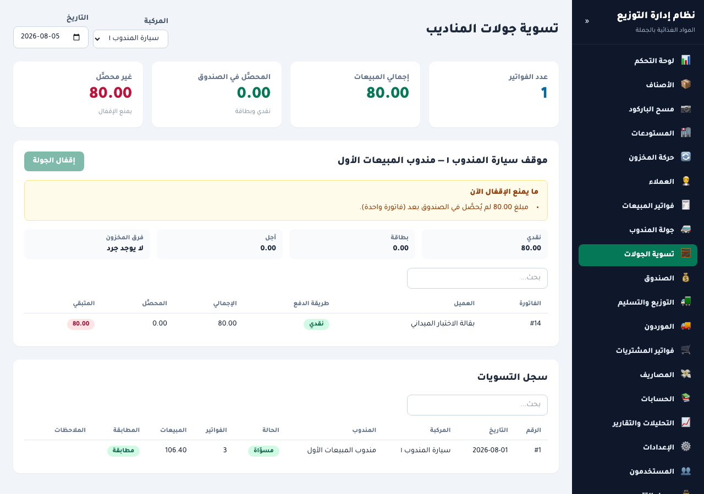

السيارة تخرج محمّلة وتعود بنقد، وبمخزون أقلّ، وبحزمة فواتير. كل واحد من هذه الثلاثة كان النظام يسجّله أصلاً — لكن لم يكن هناك ما يقول إنّ يوماً بعينه **قد رُوجِع وأُقفِل**. وهذا النقص كان خفيّاً بطبيعته: جولة لم يقفلها أحد تبدو تماماً كجولة لم يكن فيها بيع.

هذه الشاشة هي ذلك الإقفال. تُختار المركبة والتاريخ، فيظهر موقف الجولة كاملاً: ما بِيع، وما وصل الصندوق، وما بقي.

### ما تفعله الشاشة وما لا تفعله

الحدّان التاليان مقصودان، وكلاهما موجود لمنع اختلال الدفاتر:

- **لا تُحرّك ريالاً.** نقد السيارة يُحصَّل في شاشة الصندوق، وهي المكان الوحيد الذي تُكتب فيه حركة نقدية. فالتسوية **تشترط** أن يكون النقد قد حُصِّل، وتسجّل ما وجدته — لو حصّلت هي أيضاً لاحتُسب كل ريال مرّتين.
- **لا تُعدّل مخزوناً.** الجرد المُثبَّت يعالج الفروق بنفسه لكل تشغيلة. فالتسوية تربط نفسها بذلك الجرد بدل أن تكرّره — ومسارَان يعدّلان نفس التشغيلات هو بالضبط ما يجعل المخزون والحسابات يفترقان.

### البوّابتان

| البوّابة | السلوك | لماذا؟ |
|---------|--------|--------|
| **نقد لم يُحصَّل** | **يمنع الإقفال — بلا استثناء** | النقد ليس اجتهاداً: إمّا سُلّم أو لم يُسلّم |
| **فرق مخزون** | لا يمنع، لكن **لا يمرّ بصمت أبداً** | يلزمه سبب مكتوب دائماً، وإقرار مسؤول إذا تجاوز الحدّ |

**ولماذا لا يُمنع الإقفال عند فرق المخزون؟** لأن المنع سيكون أسوأ من عدم الفائدة: الجولة لا تُقفل، وجولة الغد لا تُفتح (جولة مفتوحة واحدة لكل مركبة)، والضغط يقع في النهاية على من يَعُدّ البضاعة — فتخرج دفاتر مرتّبة ورفوف غير صادقة.

صندوق **«ما يمنع الإقفال الآن»** يعرض الأسباب الفعلية، وزر الإقفال يبقى معطّلاً حتى تُعالَج.

### حدّ الإقرار

يُضبط من لوحة الإعدادات (الفصل 2). الفرق الذي يتجاوزه يحتاج صلاحية **«إقرار فروقات الجولات»**، وهي عند المدير والمحاسب فقط — **لا عند أمين المستودع.** والسبب مبدأ فصل المهام: **من يَعُدّ البضاعة لا يُقرّ نقصها.** أمين المستودع يُقفل الجولات المطابقة ويكتب أسباب الفروق الصغيرة، لكن الفرق الكبير يحتاج توقيعاً من غيره.

### الفرق بالوحدات، لا بالمال فقط

الشاشة تعرض الفرق **بالوحدات** ثم بقيمته. والسبب مهم: القيمة تُحسب بتكلفة التشغيلة، **وتكون صفراً إذا كانت التكلفة غير مسجّلة**. فلو نظرت إلى المال وحده، لظهرت سيارة عادت ناقصة عشرين حبة وكأنها متوازنة تماماً. النقص في البضاعة نقص، سواء عُرِف ثمنه أو لا.

### خطوة واحدة تكفي

الشائع أن يُجرَد السيارة ثم يُضغط **«إقفال الجولة»** — والنظام يفتح الجولة تلقائياً إن لم تكن مفتوحة. من أراد تسجيل تسليم الصباح صراحةً فله ذلك، لكنه غير إلزامي: تلك الخطوة لم تكن تسجّل إلا تاريخاً وملاحظة، والمقارنة بين المتوقّع والمعدود التي كانت تبرّرها **هي أصلاً ما يفعله الجرد**.

### التنبيه في لوحة التحكم

المركبة التي باعت اليوم ولم تُقفل جولتها تظهر في لوحة التحكم تلقائياً:

- **«جولات مناديب لم تُسوَّ بعد»** — تحذير برتقالي، النقد وصل الصندوق والجولة جاهزة للإقفال.
- **«جولات لم تُسوَّ ونقدها لم يُحصَّل»** — تنبيه أحمر. وهذا أهمّ الحالتين: نقد في جيب مندوب ليلة كاملة أخطر من ورقة ناقصة.

والتنبيه يختفي بمجرّد إقفال الجولة — التنبيه الذي لا يزول يُعلّم الناس تجاهُل التنبيهات.

### 🔧 مثال عملي: إقفال يوم سالم

**5:00 مساءً — سالم يعود بالسيارة.**

**١) الجرد.** أمين المستودع يعُدّ ما في السيارة (الفصل 8) ويُثبّت الجرد. النتيجة: **ناقص كرتونة عصير واحدة**، قيمتها 45.00.

**٢) فتح الشاشة.** `تسوية الجولات` → المركبة `سيارة المندوب ١`، التاريخ اليوم. يظهر:

| | |
|---|---|
| عدد الفواتير | 3 |
| إجمالي المبيعات | 106.40 |
| المحصَّل في الصندوق | 0.00 |
| **غير محصَّل** | **106.40** |

وزر الإقفال معطّل، والصندوق البرتقالي يقول: **«مبلغ 106.40 لم يُحصَّل في الصندوق بعد (3 فواتير).»**

**٣) التحصيل.** سالم يسلّم النقد لأمين الصندوق، وهذا يحصّل الفواتير الثلاث من شاشة الصندوق (الفصل 11). بالرجوع إلى شاشة التسوية: **غير محصَّل 0.00**، والزر صار متاحاً.

**٤) الإقفال.** يُضغط «إقفال الجولة». الشاشة تنبّه: **«الجولة بها فرق مخزون 1.000 وحدة — اكتب سبب الفرق، وهو إلزامي.»**

الفرق 45.00 **أقلّ من حدّ الإقرار** (50.00 افتراضياً)، فيكفي أمين المستودع أن يكتب: `كرتونة عصير تلفت في الصندوق الخلفي` ويؤكّد.

**النتيجة:** تسوية برقم `#1` بحالة **مسوّاة**، تحمل شارة **فرق 1.000 وحدة** لا «مطابقة» — والسبب مكتوب فيها إلى الأبد. التنبيه اختفى من لوحة التحكم.

**ولو كان الناقص كرتونتين بقيمة 90.00؟** يتجاوز الحدّ، فيُرفض الإقفال برسالة صريحة: **«فرق المخزون (90.00) يتجاوز حدّ الإقرار»** — وينتظر المدير أو المحاسب.

> **لاحظ:** التسوية لم تُحرّك المخزون ولم تُنشئ قيداً. الجرد في الخطوة ١ هو الذي عالج الكرتونة الناقصة محاسبياً ومخزنياً. التسوية سجّلت أنّ اليوم **رُوجِع، وأنّ أحداً وقّع عليه**.

---

## 15. المصاريف

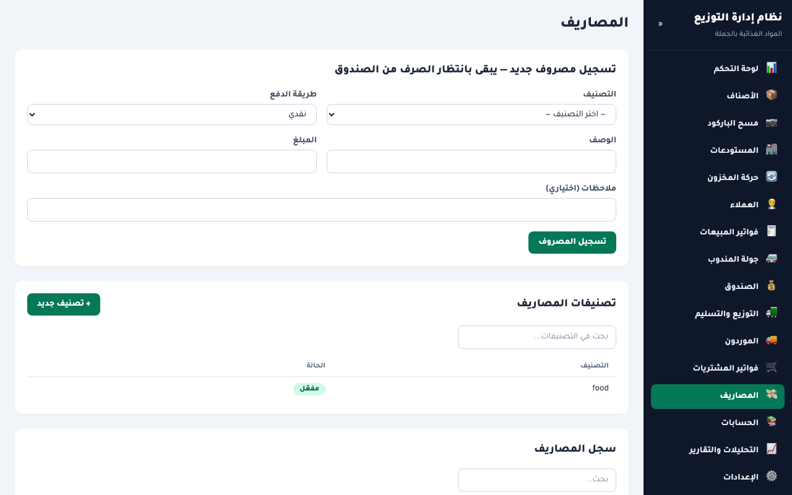

لتسجيل مصاريف التشغيل: وقود، صيانة، رواتب، إيجار، كهرباء…

1. **أنشئ تصنيفات المصاريف** أولاً (تصنيف واحد لكل نوع).
2. **سجّل المصروف:** التصنيف، الوصف، المبلغ، طريقة الدفع، وملاحظة اختيارية.
3. المصروف يبقى **بانتظار الصرف من الصندوق** — ويصرفه أمين الصندوق من شاشته (الفصل 11)، فيُنشأ القيد المحاسبي عندها.

هذا الفصل بين «التسجيل» و«الصرف» متعمَّد: الموظف يسجّل، وأمين الصندوق يدفع، وكلاهما موثّق باسمه.

### 🔧 مثال عملي

1. **المصاريف** ← أضف تصنيفاً: `وقود ومحروقات`.
2. **تسجيل مصروف جديد:** التصنيف `وقود ومحروقات` — الوصف `تعبئة سيارة التوزيع أ ب ج 5678` — المبلغ `250.00` — الدفع `نقدي`.
3. يظهر في **الصندوق ← المستحقات الصادرة** → يصرفه أمين الصندوق.
4. القيد: مدين **5020 — مصاريف عمومية** 250.00 / دائن **1010 — الصندوق** 250.00.

---

## 16. الحسابات والقيود والتقارير المالية

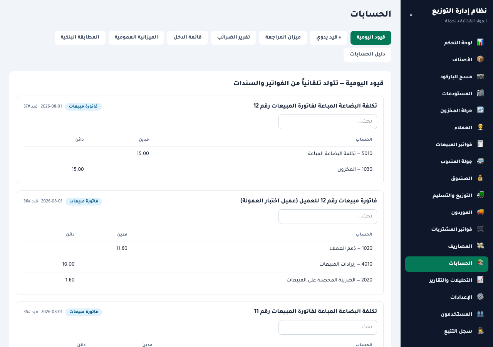

**لا تحتاج لتسجيل قيود يدوية في العمل اليومي.** كل فاتورة وسند ومصروف وجرد يُنشئ قيده المحاسبي المزدوج تلقائياً. هذه الشاشة للمراجعة والتقارير.

### التبويبات

| التبويب | الوظيفة |
|---------|---------|
| **قيود اليومية** | كل القيود مرتّبة زمنياً، وكل قيد مربوط بالمستند الذي ولّده |
| **+ قيد يدوي** | للتسويات الاستثنائية فقط (الأرصدة الافتتاحية، الإهلاك) |
| **ميزان المراجعة** | أرصدة كل الحسابات — مجموع المدين يجب أن يساوي مجموع الدائن |
| **تقرير الضرائب** | الضريبة المحصّلة على المبيعات مقابل المدفوعة على المشتريات خلال فترة |
| **قائمة الدخل** | الإيرادات − التكلفة − المصاريف = صافي الربح |
| **الميزانية العمومية** | الأصول = الخصوم + حقوق الملكية |
| **المطابقة البنكية** | مطابقة حركات النظام بكشف حساب البنك وتحديد الفروقات |
| **دليل الحسابات** | شجرة الحسابات وإضافة حسابات جديدة |

### دليل الحسابات الأساسي

| الرمز | الحساب | النوع |
|-------|--------|-------|
| 1010 | الصندوق | أصل |
| 1015 | البنك | أصل |
| 1020 | ذمم العملاء | أصل |
| 1030 | المخزون | أصل |
| 2010 | ذمم دائنة (الموردون) | التزام |
| 2020 | الضريبة المحصلة على المبيعات | التزام |
| 3010 | رأس المال | حقوق ملكية |
| 4010 | إيرادات المبيعات | إيراد |
| 4020 | مرتجعات المبيعات | إيراد (مقابل) |
| 4030 | خصم مسموح به | إيراد (مقابل) |
| 5010 | تكلفة البضاعة المباعة | مصروف |
| 5020 | مصاريف عمومية | مصروف |
| 5030 | خسائر التلف | مصروف |
| 5040 | فروقات الجرد | مصروف |

### 🔧 مثال عملي: إدخال الأرصدة الافتتاحية

عند بدء استخدام النظام ولديك 50,000 ر.س رأس مال نقداً:

1. **الحسابات** ← **+ قيد يدوي**.
2. البيان: `رصيد افتتاحي — بداية التشغيل`.
3. السطر الأول: `1010 — الصندوق` مدين `50,000.00`.
4. السطر الثاني: `3010 — رأس المال` دائن `50,000.00`.
5. احفظ. النظام **يرفض حفظ أي قيد لا يتوازن فيه المدين مع الدائن**.

> أرصدة الموردين الافتتاحية أسهل: أدخلها في حقل «رصيد افتتاحي» في بطاقة المورد مباشرة.

---

## 17. التحليلات والتقارير الإدارية

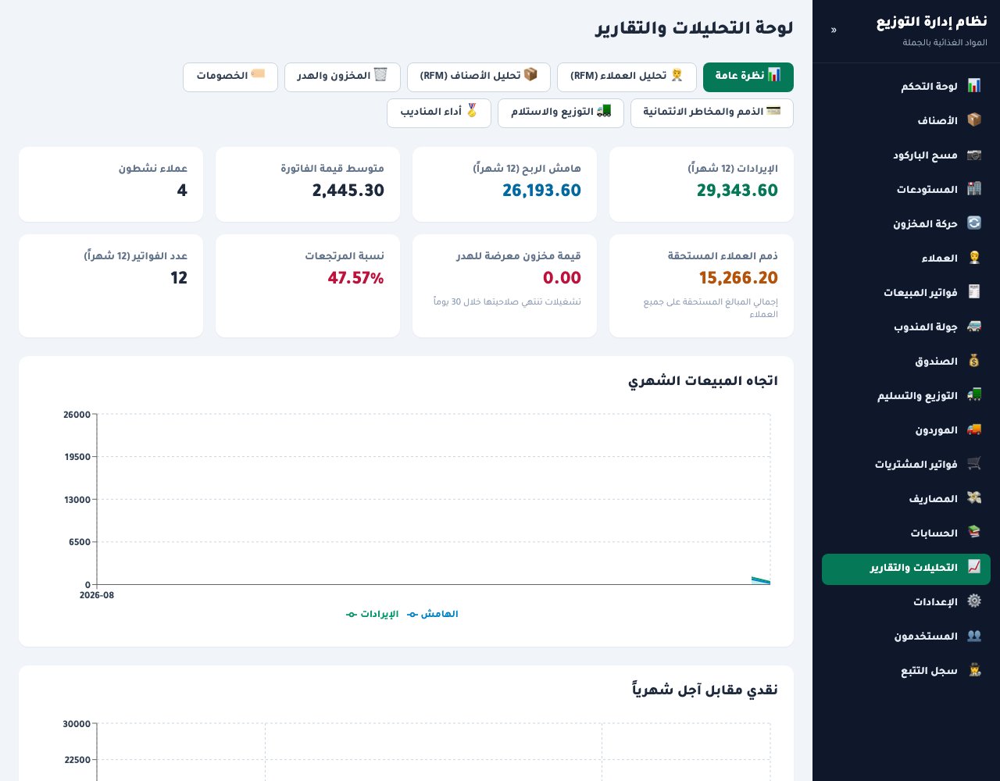

لوحة القرار للمدير. كل تبويب يجيب عن سؤال إداري محدّد:

| التبويب | يجيب عن |
|---------|---------|
| **نظرة عامة** | كيف حالنا؟ الإيرادات وهامش الربح (12 شهراً)، متوسط الفاتورة، عدد الفواتير، نسبة المرتجعات، ذمم العملاء المستحقة، قيمة المخزون المعرَّض للهدر، مع رسمي «اتجاه المبيعات الشهري» و«نقدي مقابل آجل» |
| **تحليل العملاء (RFM)** | من هم عملاؤنا المهمّون؟ ومن بدأ يبتعد؟ تصنيف بحسب حداثة الشراء وتكراره وقيمته |
| **تحليل الأصناف (RFM)** | ما الأصناف التي تدور بسرعة، وما الراكد الذي يأكل رأس المال؟ |
| **المخزون والهدر** | كم خسرنا في التالف والمنتهي؟ وأي الأصناف أكثر هدراً؟ |
| **الخصومات** | كم خصماً منحنا؟ ومن منحه؟ ولأي عميل؟ |
| **الذمم والمخاطر الائتمانية** | من تجاوز حدّه؟ ومن تأخّر؟ وأعمار الديون |
| **التوزيع والاستلام** | أداء رحلات التوزيع ونسب التسليم في الوقت |
| **أداء المناديب** | مبيعات كل مندوب ومرتجعاته وعمولته |

معظم التقارير قابلة للطباعة بتصميم عربي مرتّب.

### تصفية تحليلي RFM

في تبويبَي RFM شريط تصفية أعلى الشاشة يضيّق التحليل من «كل شيء» إلى السؤال الذي تريده فعلاً:

| التبويب | التصفية | السؤال الذي تجيب عنه |
|---------|---------|----------------------|
| **تحليل العملاء** | باختيار **صنف** (اكتب الرمز أو الاسم) | من يشتري هذا الصنف؟ ومن توقّف عنه؟ ومن لم يشترِه قطّ؟ |
| **تحليل الأصناف** | باختيار **عميل** من القائمة | ما الذي يشتريه هذا العميل؟ وما الذي لم يشترِه بعد؟ |

والمؤشرات الثلاثة تضيق معاً: عند اختيار صنف، **الحداثة** تصبح آخر مرة اشترى العميل *هذا الصنف*، و**التكرار** عدد الفواتير التي احتوته، و**القيمة** ما أنفقه عليه. ولو ضاقت القيمة وحدها لبدا التقرير صحيحاً وهو مضلّل.

**ومن لم يشترِ يبقى في القائمة بقيمة صفر** — وهذا مقصود: التقرير المصفّى يصبح **قائمة استهداف**. صفِّ بصنف لترى من لم يجرّبه بعد، أو صفِّ بعميل لترى ما يمكن أن تعرضه عليه في الزيارة القادمة (مع مخزونه الحالي أمامك في الجدول).

> **ملاحظتان مهمّتان عند القراءة:**
> - **المخزون وأقرب صلاحية لا يتأثران بتصفية العميل** — فهما وصف للرفّ لا للعميل؛ الرفّ واحد لكل العملاء.
> - **أساس القيمة يتغيّر:** بلا تصفية، القيمة هي إجمالي الفاتورة (بعد الخصم ومع الضريبة). ومع تصفية بصنف، هي قيمة أسطر الصنف (قبل الضريبة وقبل خصم الفاتورة، لأن الخصم يخصّ الفاتورة كلها ولا يمكن نسبته لسطر واحد). عنوان العمود يتغيّر إلى **«قيمة الصنف»** لينبّهك، والرقم يطابق تماماً ما يظهر في تحليل الأصناف مصفّىً بنفس العميل.

### 🔧 مثال عملي: هل نُوقف صنفاً؟

صنف تظنّه راكداً وتفكّر في إيقافه:

1. في **تحليل الأصناف** ابحث عنه: إن كان «راكد (Dead Stock)» وأقرب صلاحيته قريبة، فالخسارة قادمة.
2. انتقل إلى **تحليل العملاء** وصفِّ **بهذا الصنف**: من كان يشتريه؟
3. إن ظهر عميلان أو ثلاثة بشريحة «معرض للخطر» أو «خامل» — فالصنف ليس ضعيفاً، بل **عملاؤه هم من ابتعدوا**. اتصال المندوب أرخص من إيقاف صنف له سوق.
4. وإن كان «لم يشترِه أحد» فعلاً، فالقرار واضح: صرّفه بعرض قبل انتهاء صلاحيته، ولا تعد طلبه.

### 🔧 مثال عملي: قراءة نسبة المرتجعات

في «نظرة عامة» تجد **نسبة المرتجعات**. إذا كانت مرتفعة:

1. افتح **المخزون والهدر** لترى أي الأصناف تُرتجع أكثر.
2. إن كان الغالب «تالف بسبب النقل» → المشكلة في التحميل والمناولة، لا في المنتج.
3. إن كان الغالب «منتهي الصلاحية» → راجع تبويب **قرب الانتهاء** أسبوعياً وصرّف المخزون القديم بعروض قبل أن يتحوّل لخسارة.

---

## 18. سجل التتبّع

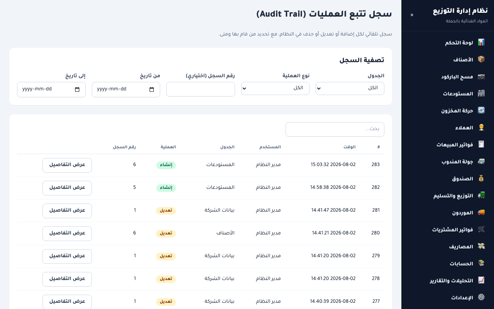

سجل غير قابل للتعديل يوثّق **من فعل ماذا ومتى**: كل إنشاء وتعديل وحذف في النظام، مع اسم المستخدم والوقت والقيمة قبل التغيير وبعده.

استخدمه للإجابة عن أسئلة مثل: «من عدّل سعر هذا الصنف؟» أو «من ألغى إتلاف الأمس؟». الصلاحية عليه محصورة بمن تمنحه إياها.

---

## 19. أسئلة شائعة وحلّ المشكلات

**«لا أرى وحدة في القائمة الجانبية»**
صلاحياتك لا تشملها. راجع المدير — القائمة تعرض ما تملك صلاحيته فقط.

**«الفاتورة الآجلة مرفوضة بسبب الحد الائتماني»**
حصّل دفعة من العميل أولاً، أو أصدرها نقدية، أو اطلب موافقة من يملك صلاحية تجاوز الحد.

**«لا أستطيع إدخال بضاعة بدون تاريخ انتهاء»**
هذا متعمَّد. رقم التشغيلة وتاريخ الانتهاء إلزاميان لكل مادة غذائية داخلة، وعليهما تقوم قاعدة FEFO وتنبيهات الصلاحية.

**«الفاتورة النقدية لا تظهر في شاشة التوزيع»**
لأنها **بانتظار الصندوق**. لن تظهر للتسليم قبل أن يؤكّد أمين الصندوق قبض المبلغ.

**«النظام باع من تشغيلة غير التي أردت»**
هذا هو المطلوب. FEFO تختار الأقرب انتهاءً تلقائياً لتقليل الهدر.

**«سجّلت إتلافاً بالخطأ»**
استخدم زر الإلغاء في سجل التعديلات — يُعيد الكمية ويعكس القيد، ويُبقي السجل موثّقاً بعلامة «ملغى».

**«حصّلت مبالغ لكن تقرير إقفال الصندوق يظهر صفراً»**
راجع **توقيت الشركة** في لوحة الإعدادات. إن كان على UTC وأنتم في توقيت مختلف، فالتحصيل الذي يقع بعد منتصف الليل بتوقيتكم يُحسب على اليوم السابق. المبالغ مسجّلة ولم تضِع — التقرير كان ينظر في يوم آخر. اضبط التوقيت ثم افتح التقرير من جديد.

**«سجّلت مرتجعاً على الفاتورة الخطأ»**
تبويب «المرتجعات» ← زرّ **إلغاء**. تُسحب الكمية، ويُعكس القيد، وتعود الفاتورة مستحقّة بكاملها. الصلاحية عند المحاسب. ويُرفض الإلغاء إن كان المبلغ قد رُدّ للعميل نقداً — استرجعه أولاً — أو إن بِيعت البضاعة بعد إرجاعها.

**«ألغيتُ مرتجعاً، فهل يبقى ظاهراً في التقارير؟»**
لا. المرتجع الملغى يخرج من كل رقم مالي: المستحق عند الصندوق، رصيد العميل، كشف الحساب، تقرير الضريبة، تسوية الجولة، ملاحظة التجهيز، ونِسَب المرتجعات في التحليلات. يظهر فقط في **قائمة المرتجعات نفسها** بعلامة «ملغى» وسببه — للتوثيق لا للحساب.

**«أرقام الجرد اختلفت لأن بيعاً حدث أثناء العدّ»**
لا مشكلة: الترحيل يُطبّق **الفرق** لا الكمية المطلقة، فالبيع الذي حدث أثناء الجرد لا يُلغى.

**«المندوب باع ولم تظهر الفاتورة في النظام»**
افتح شاشة الجولة على جواله: إن ظهر «ن بانتظار الرفع» فالعمل محفوظ وسيُرفع عند عودة الشبكة. إن ظهر «(ن مرفوض)» فاقرأ سبب الرفض المرفق بالمستند.

**«هل يمكن أن تتكرّر فاتورة المندوب إذا رُفعت مرتين؟»**
لا. كل مستند يحمل معرّفاً فريداً من الجهاز، والخادم يتعرّف على المُعاد إرساله فلا يُنشئه مرتين.

**«لا أستطيع إقفال جولة المندوب»**
اقرأ صندوق «ما يمنع الإقفال الآن». السبب الأغلب أن نقد الجولة لم يُحصَّل في الصندوق بعد — وهذا مانع بلا استثناء: حصّل الفواتير من شاشة الصندوق ثم أعِد المحاولة.

**«الجولة بها فرق مخزون ولا يقبل الإقفال»**
الفرق لا يمنع الإقفال، لكنه يلزمك بأمرين: **سبب مكتوب** دائماً، و**إقرار من المدير أو المحاسب** إذا تجاوز الفرق الحدّ المضبوط في الإعدادات. أمين المستودع لا يُقرّ الفروق الكبيرة بنفسه، لأن من يَعُدّ البضاعة لا يُقرّ نقصها.

**«فرق المخزون يظهر 0.00 مع أن السيارة عادت ناقصة»**
القيمة تُحسب بتكلفة التشغيلة، وتكون صفراً إذا لم تكن التكلفة مسجّلة. **انظر إلى الفرق بالوحدات** — هو المقياس الصحيح، والنظام يمنع الإقفال الصامت بناءً عليه لا على المال.

**«نسيت فتح الجولة صباحاً — هل ضاع اليوم؟»**
لا. اضغط «إقفال الجولة» مباشرة والنظام يفتحها ويقفلها في خطوة واحدة. فتح الجولة صباحاً اختياري.

**«التنبيه يقول إن جولة لم تُسوَّ، والمندوب لم يبع شيئاً»**
التنبيه لا يظهر إلا لمركبة **باعت فعلاً** اليوم ولم تُقفل جولتها. تحقّق من قائمة الفواتير في شاشة التسوية — ستجد ما بِيع عليها.

**«حذفت ضريبة — هل تأثّرت فواتير الشهر الماضي؟»**
لا. كل فاتورة تحتفظ بنسخة من الضريبة المطبّقة عليها وقت إصدارها.

---

## 20. مسرد المصطلحات

| المصطلح | المعنى |
|---------|--------|
| **FEFO** | *First Expired, First Out* — يُصرف أولاً ما يقترب انتهاء صلاحيته أولاً |
| **التشغيلة (Batch)** | دفعة إنتاجية لها رقم وتاريخ انتهاء، وهي وحدة تتبّع الصلاحية |
| **UoM** | وحدة القياس (حبة، عبوة، كرتونة، كيس) بمعامل تحويل ثابت |
| **الوحدة الأساسية** | أصغر وحدة، وبها تُحفظ كل الأرصدة |
| **فئة السعر** | جملة / نصف جملة / تجزئة — تُحدَّد لكل عميل |
| **الحد الائتماني** | أقصى مديونية مسموحة للعميل في البيع الآجل |
| **RBAC** | التحكم في الوصول القائم على الأدوار |
| **قائمة التجهيز (Picking List)** | ورقة يمشي بها عامل المستودع لتجميع طلبيات الرحلة |
| **بانتظار الصندوق** | فاتورة نقدية لم يُقبض مبلغها بعد، ولا تُسلَّم قبل ذلك |
| **حساب مقابل (Contra)** | حساب يُخفّض حساباً آخر — مثل «خصم مسموح به» الذي يُخفّض الإيراد |
| **الإيصال المؤقّت** | مرجع `FLD-XXXXXXXX` يُعطى للعميل في الميدان قبل صدور الرقم الرسمي |
| **المزامنة (Sync)** | رفع ما سجّله المندوب دون اتصال إلى الخادم |
| **الجرد (Stocktake)** | العدّ الفعلي للمخزون وتسوية فروقاته محاسبياً |
| **تسوية الجولة** | إقفال يوم المندوب: مراجعة ما بِيع وما حُصِّل وما عاد، والتوقيع عليه |
| **حدّ الإقرار** | أقصى فرق مخزون يُقفل بسبب مكتوب فقط؛ ما فوقه يحتاج إقرار مسؤول |
| **فصل المهام** | ألا يجتمع العدّ والإقرار في يد واحدة — ضمانة ضد تمرير النقص بصمت |
